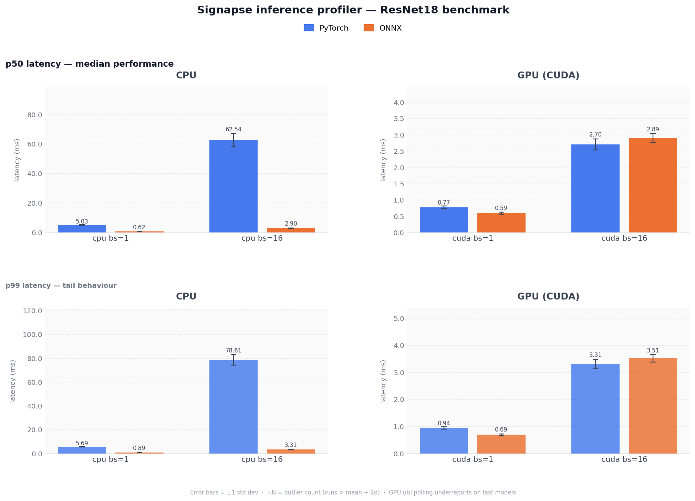
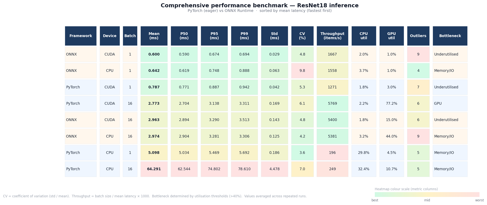

---

## Section 3 — Code Task


to run the benchmark:

Build the docker file and from the container:

```
bash run_full_benchmark.sh
```

or directly from terminal:

```
docker run --rm --gpus all -v $(pwd):/workspace section3-code bash run_full_benchmark.sh
```
  





The approach started with profiler.py, which uses:

        - A dataclass (BenchmarkResult) for the results and stats
        - A function to benchmark the model and record latencies
        - GPU utilisation tracking initially using smi, but moved to pynvml for better integration and reliability (left smi in as a fallback)
        - ONNX export and benchmarking - (this was listed as just a 'bonus' (and also specifically stated that we didn't need to actually run it), but I was keen to implement it (and actually get it running) and ended up faffing around for quite a long time with onnx dependency issues - did not have time to fully see it through, but onnx with cpu is running as anticipated. Code is in place for onnx gpu benchmarking and currently it falls back to cpu.)


Initially built it as a cli tool, and then used a bash script (run_full_benchmark.sh) to orchestrate the full gamut of tests.

Saves to a csv, and then uses a python script (plot_results.py) to load the csv, generate the summary table, and produce the plot. Which can be found at benchmark_results_plot.png and benchmark_results_table.png.


Notes:

--- I am aware that the question asked specifically for a python file, but you also said you wanted to see how I think, and orchestrating python with bash is often how I work. I find it keeps a neater seperation of concerns.

--- I'm noticing a baseline wobble between 1-20% for GPU Util on my machine even when the gpu is idle - my production server is my dev server for this task and I think just having some youtube up in the background might be contributing. 


