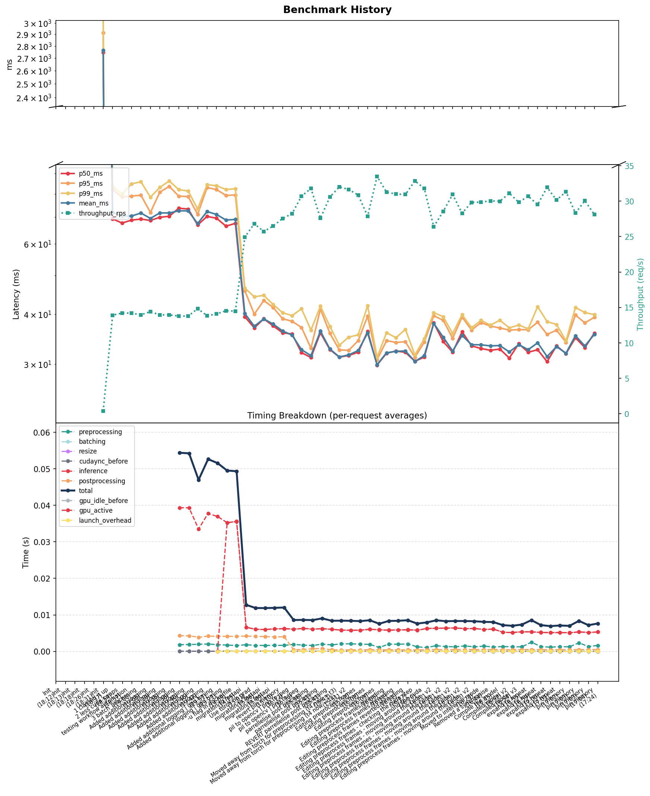

 

The approach here is to start with evaluation.

Copy the original files into an old and new folder. And build a benchmark tool so that we can directly evaluate the results of our changes.

The results of every change are saved into a 'never reset' file, so that we can track the impact of each change, and make a nice graph of our progress towards a production-ready inference server.


-- Note:

        I've left in all the evaluation scaffolding, which does look a bit messy to me, but does show thinking during the process.

        I think really I should lock it all away behind a 'DEBUG' flag, but that's polish for another day.


 


# Benchmarking Usage

To benchmark the inference server and track improvements over time:

1. Ensure the server is running (see Docker instructions below).
2. Run the benchmarking tool:

```
python3 benchmark_inference_server.py --commit-message "Describe your change here"
```

- Each run appends results to `benchmark_history.csv` (never reset).
- The `--commit-message` flag is required for changelog tracking.
- You can adjust other options (requests, frames, etc.) as needed. See `--help` for details.

# Docker Usage
 
 ## Build the Docker image
 
 ```
 docker build -t section4-inference .

 docker build -t section4-inference-old ./old 

 docker build -t section4-inference-new ./new

 ```
 
 ## Run the Docker container
 
```
docker run --rm -p 8080:8080 section4-inference

docker run --rm --gpus all -p 8080:8080 section4-inference-old

docker run --rm --gpus all -p 8080:8080 section4-inference-new
```
 

## Run the evaluation benchmark - this runs the Docker container on one thread, and then runs the benchmark script inside the container.

```
bash ./run_benchmark_new.sh "your commit message"
```


--- dev Notes:


Moved from 100 to 50 requests as 100 was slooow on the initial version.
